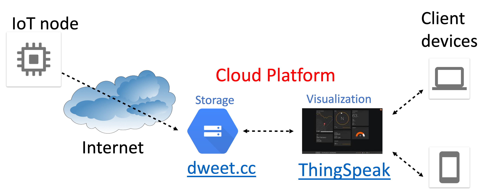

# CPE371 Big Data Engineering - Lab Report
## IoT & Spark Stream Processing Pipeline

**Course**: CPE371 Big Data Engineering  
**Academic Year**: 2569 / Semester 1  

---

### Team Members
| No. | Student Name | Student ID | Primary Responsibility |
|---|---|---|---|
| 1 | Sorawit Chaithong | 67070503442 | Spark Structured Streaming & Analytics |
| 2 | Kittiphat Noikate | 67070503459 | Data Ingestion & MQTT Pipeline |
| 3 | Piti Srisongkram | 67070503467 | Cloud Integration & Actuator Automation |

---

## 1. Project Overview & Architecture
The objective of this laboratory is to construct a scalable, real-time IoT big data analytics system. The architecture integrates edge sensor simulation, low-latency MQTT message queues, continuous streaming file ingestion, PySpark Structured Streaming for aggregation and windowing, and cloud visualization and smart home actuation.

### Architecture Diagram

### End-to-End Workflow:
1. **IoT Sensor Ingestion**: Sensor telemetry from `data/CPE371_datalog.csv` is streamed through an MQTT broker.
2. **Landing Buffer**: An MQTT bridge subscribes to incoming messages and lands atomic micro-batches in `iot_landing/`.
3. **Stream Processing**: PySpark Structured Streaming continuously monitors `iot_landing/`, applies windowed aggregations, calculates moving averages for temperature and AQI, and flags anomalies.
4. **Cloud Integration & Actuation**: Aggregated telemetry is pushed to cloud platforms (dweet.cc / ThingSpeak) and triggers actuator commands (e.g. Air Conditioner and Air Purifier state changes).

---

## 2. Directory Structure & Environment
The project is organized modularly:
- `data/`: Contains raw sensor datasets (`CPE371_datalog.csv`).
- `iot_landing/`: Ephemeral landing zone for streamed JSON micro-batches.
- `notebooks/`: Interactive development and prototyping notebooks.
- `src/`: Modular Python scripts for publication, bridging, streaming, cloud forwarding, and actuation.
- `docs/`: Architecture diagrams and technical documentation.

---

## 3. Implementation Details
*(To be expanded as feature development progresses across milestones)*

### 3.1 Data Ingestion & MQTT Pipeline (`feat/mqtt`)
- Simulated sensor streams using `src/mqtt_publisher.py`.
- Topic hierarchy: `CPE_DEMO_HOUSE/<room_id>`.
- Reliable file landing via `src/mqtt_bridge.py`.

### 3.2 Spark Stream Processing (`feat/spark`)
- PySpark Structured Streaming with watermarked sliding windows.
- Aggregation of temperature, humidity, and AQI indices.
- Fault-tolerant checkpointing.

### 3.3 Cloud Forwarding & Actuator Control (`feat/cloud`)
- Dweet.cc and ThingSpeak REST API integrations via `src/cloud_forwarder.py`.
- Real-time rule-based feedback control via `src/actuator_logic.py`.

---

## 4. Experimental Results & Observations
*(To be recorded during end-to-end integration and streaming execution)*

---

## 5. Conclusion
*(Summary of findings, throughput measurements, and pipeline scalability)*